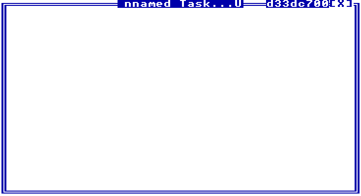

# TempleLib
**Warning: The library is in extremely pre-alpha, and is far from feature complete.**

TempleLib is C library that aims to provide a development environment and UI similar to TempleOS. The goal is to create an almost 1:1 recreation of the graphics and doc API from TempleOS, without user programs needing to interact with any SDL data structures.

Please note that this is my first library using SDL and C, so the code might be a bit amateur.



## TODO
 - Implement the full set of Graphics functions.
 - Implement the full set of Doc functions.
 - Keyboard input.
 - Scroll wheel support.
 - Add Memory address to window border. I don't really know what I will use for this though.
 - Add compiling to a shared library.
 - Change the directory where the glyph sheet is stored.
### Done
 - Custom window borders with movement and resizing.

## Running/Using
1. Download the source:
```sh
    git clone https://github.com/Berserkware/templelib
    cd templelib
``` 
2. Run CMake
```sh
    cmake .
```
3. Run Make
```sh
    make
```
4. Run the demo
```sh
    ./templelib/demo
```
To learn how to develop with the library, you can look through the source and demo code. I will create full
documentation when the library is out of pre-alpha.

## Contributing
Since the library is in early alpha, any contributions would be much appreciate. You can contribute by creating issues or pull requests. Also, feel free to majorly restructure parts of the code, since it isn't really set in stone.

### Known Bugs
 - If the window is touching the bottom of the screen, it goes super slow.

